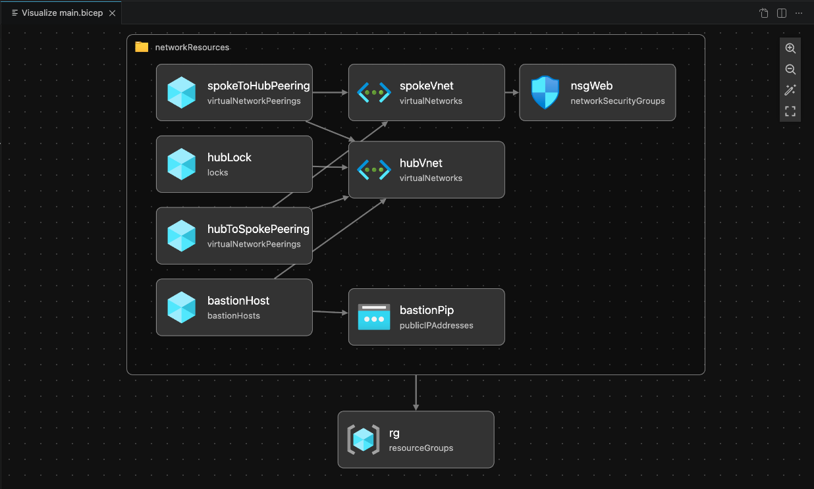
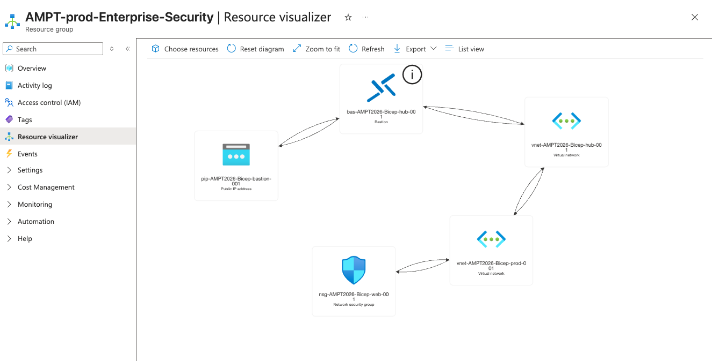
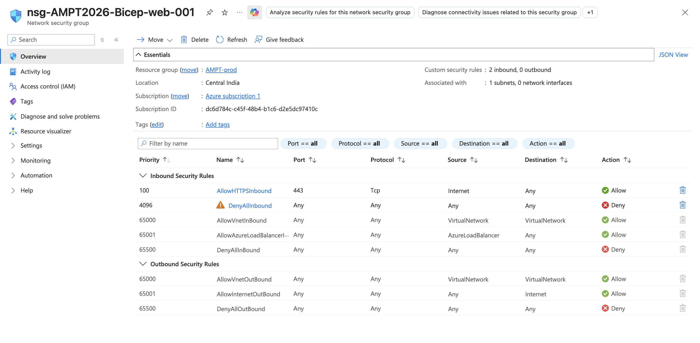

# Azure Network Landing Zone Foundation (Bicep)

### Objective
This repository deploys a production-ready **Network Landing Zone Baseline** in Azure. The architecture follows the **Hub-Spoke** model readiness and enforces micro-segmentation for a secured production workload.

### Key Infrastructure Components:
* **Infrastructure as Code (IaC):** Subscription-level deployment using modular Bicep templates.
* **VNET & Subnet Isolation:** Separated `frontend` and `isolated-db` tiers to minimize lateral movement.
* **Zero-Trust Networking:** Strict "Default-Deny" Network Security Group (NSG) policy.

### How to Deploy:

```bash
az login
az deployment sub create \
  --location centralindia \
  --template-file main.bicep

```

\

\
## Visual Documentation

### 1. Bicep Architecture Diagram (VS Code & Azure)




### 2. Deployed Resources (Azure Portal)



### 3. Security Hardening (NSG Rules)

